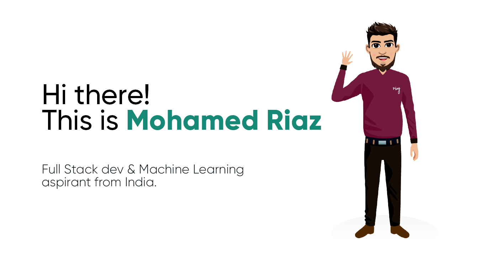

<h1 align="center"> வணக்கம் | नमस्ते | سلام ( Hi ) </h1>

Currently, doing my Full Stack & ML dev internship at <a href="https://www.pikkal.com/">Pikkal & Co</a>. I received my bachelors's degree (🎓) from <a href="https://smvec.ac.in/">SMVEC</a>. I am obsessed with <b>web development</b> and <b>data science</b>. I use Django with <b>Django-Rest framework</b> to build my backend api's and <b>ReactJS</b> for my front-end. I was fortunate enough to take up an incubation at <a href="https://www.nsrcel.org/">IIM, BANGLORE - NSRCEL</a> through <a href="https://innovate.mygov.in/india-innovation-challenge-design-contest">IICDC 2016</a>., and now that I have discovered the field of machine learning and AI, I cannot wait to put my talents at work in developing new and crays ideas to work.

  

## 💬 **Ask me about**
  - HTML5, CSS3, JavaScript, Django, ReactJS, BootStrap
  - Python
  - Machine Learning, Data Science
  - Adobe Illustrator or Photoshop and CorelDraw

  
&nbsp;

  
</img>

 

## 😎 Wana know more ?
<a href="./mohamed_riaz_2021.pdf"><button type="submit" style="border-radius:0.45rem; border:1px solid gray; padding:0.5rem 1.25rem; color:#EEEEE1; background-color:#535353; cursor: pointer;">Download my resume</button></a>